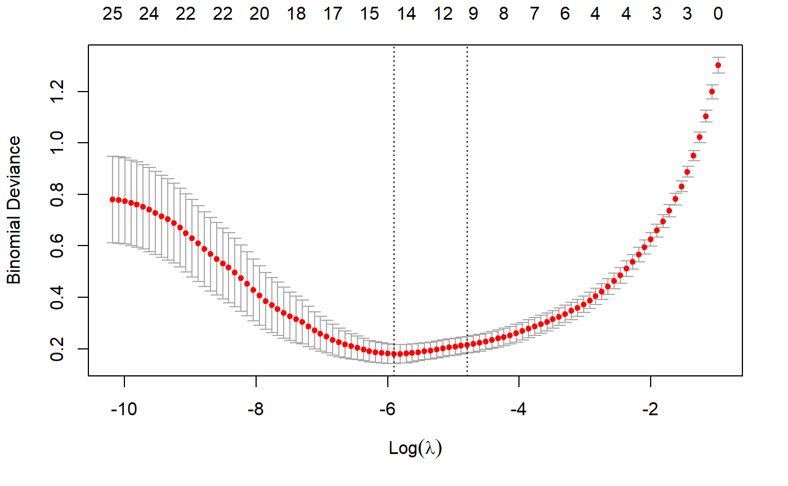
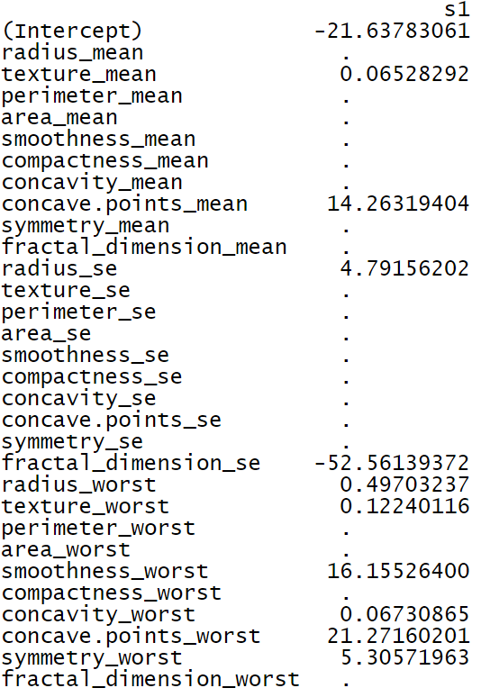
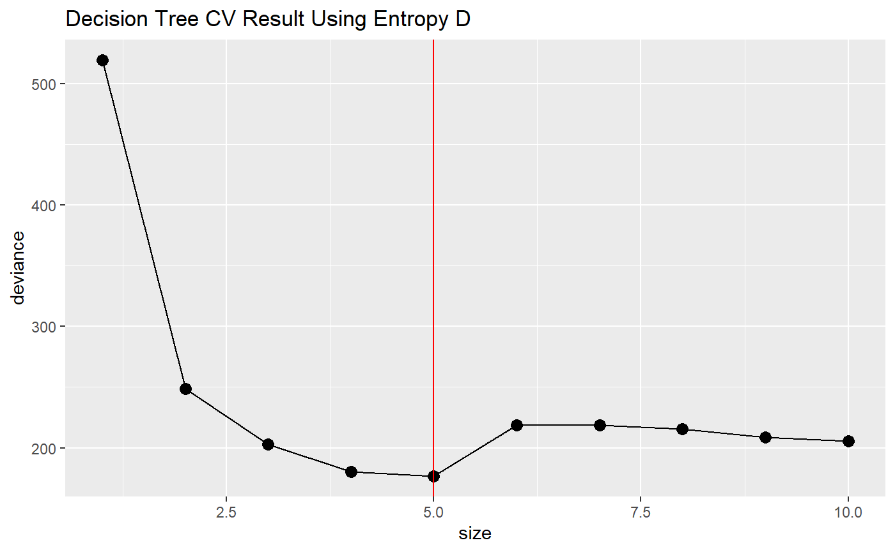
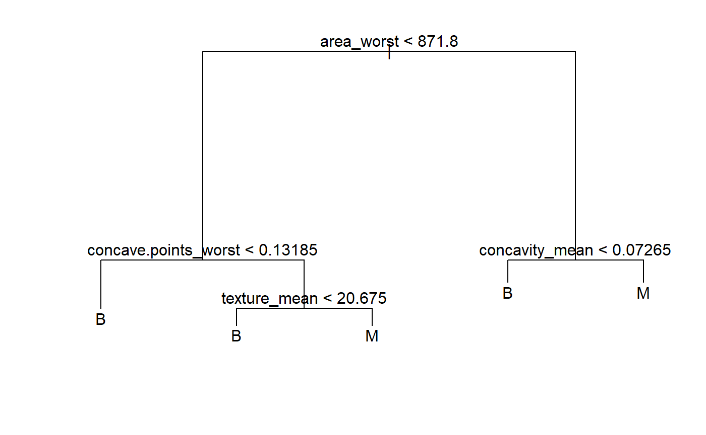
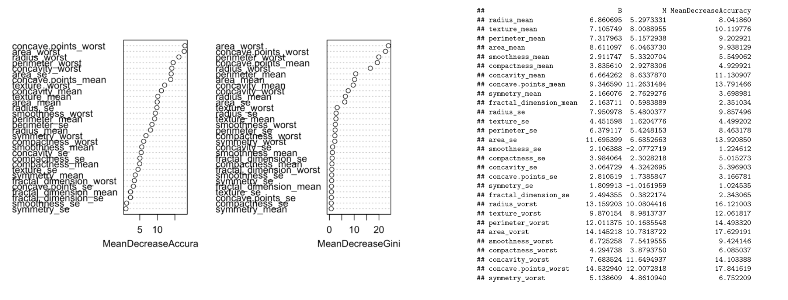
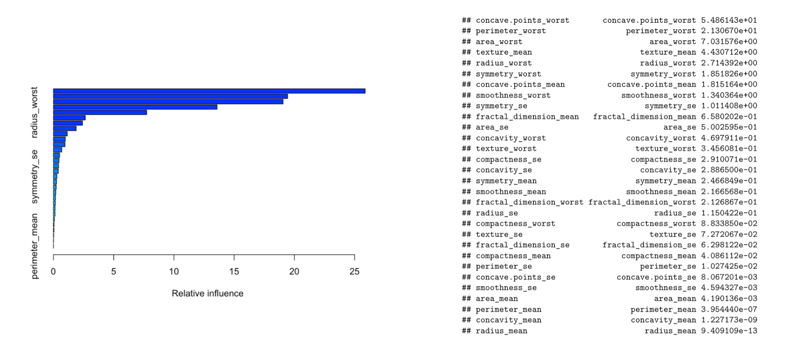

```{r setup, include=FALSE}
knitr::opts_chunk$set(echo = TRUE, message = F, warning = F)
```

# Introduction
The diagnosis of malignant or benign tumors is a vital step in cancer diagnosis and treatment process, without which a specific and effective medical treatment plan cannot be determined. The process of diagnosis is complex, involving observation of clinical presentation, laboratory examination, imaging examination, and then the pathological examination, which is also known as a biopsy. It is generally acknowledged that a biopsy is a gold standard for tumor diagnosis. However, there have been some studies questioning the reliability of the biopsy result for identifying subtle abnormalities. Also, biopsy often raises concerns of patients about the spread of cancer cells.\

Breast cancer is the second leading cause of cancer death in women. The chance that a woman will die from breast cancer is about 1 in 39 (about 2.6%). The early diagnosis of breast cancer can improve the prognosis and chance of survival significantly, as it can promote timely clinical treatment to patients. Detecting Malignant Breast Cancer Tumor in the early stage may largely enhance the 5-year and 10-year survival rate of breast cancer patients. Further accurate classification of benign tumors can prevent patients undergoing unnecessary treatments. Thus, In this project, machine learning methods are applied to assist breast cancer tumor classification and diagnosis based on a digitized image of a fine needle aspirate (FNA) of a breast mass to seek solutions for a more precise prediction besides biopsy results.The machine learning classification outcome could be a powerful tool to assist doctors in the diagnostic process. A total of six different machine learning methods are selected in this project, namely Logistic Regression, LASSO, Decision Tree, Bagging, Random Forest, and Boosting. It is hypothesized that our final test outcome would achieve 95% accuracy, as well as 95% sensitivity and specificity in the best model.\


# Related work
Breast Cancer diagnosis is one of the most intricate processes that requires a lot of medical diagnostic measurements and efforts from oncologists. One of the most widely applied methods to determine Breast Cancer tumor type is Biopsy. A series of lab tests is required to measure the tissue getting from the human body and the process of biopsy is comparatively intrusive. Also, such a method requires a lot of human effort, which is comparatively time-consuming. Also, the result might not be accurate and may not cover all parameters needed to analysis due to potential human error. \

Previously, machine learning classification of breast cancer based on RNA sequence of tumor cells have also been launched (Wu and Hicks, 2021). Even though the classification models seem accurate, the RNA sequence analysis is expensive and time consuming. Also, a lot of lab work such as PCR is required for each test sample. Therefore, a method that may simplify steps should be launched. \

Also, machine learning classification based on MRI image (Sutton et al, 2020) has been launched as well. This method is non-intrusive but still requires a high quality MRI image for analysis. \

Despite the fact that there are many applications of machine learning in the field of breast cancer classification already, our dataset and models used are still considered innovative. Moreover, one strength of our choice of dataset would be generating such dataset does not require professional trained individuals to supervise, fully digitized scales is possible to automate the entire process, which would be a more primitive method that may have wider application. \


# Methods
Our main objective is developing a machine learning model to predict tumor type based on tumor’s observational data. Based on the dataset, detailed data of breast cancer tumors are included. Hence, models constructed based on mean, standard error, and extreme values of the tumor would be evaluated and utilized separately. To give the best tumor classification outcome and to consolidate our understanding of machine learning in the meantime, four classification models, namely decision tree, random forest, boosting tree algorithm, and lasso, would be launched and compared in this project. \

Decision tree is considered as one of the classical classification models, which is very straightforward and the pattern may clearly be determined by looking at the tree map. However, the accuracy of this model may be affected by extreme values and variance. We contain this model majorly as a baseline model, which is mainly used for comparison with other models. \

Random forest is a classification method based on decision trees. Since our dataset is comparatively small (569 observations), the computational burden of the random forest may not be too heavy to achieve. Random Forests generally provide high accuracy and balance the bias-variance trade-off well. Since the model’s principle is to average the results across the multiple decision trees it builds, it averages the variance as well. Also, random forests are not influenced by outliers to a fair degree by bagging the variables. However, Random Forests are not easily interpretable. They provide feature importance but it does not provide complete visibility into the coefficients as linear regression.\

Boosting is also a machine learning method based on decision trees. Advantage of this model is the method reduces variance and bias in a machine learning ensemble. However, boosting is a slow learning algorithm, hence, our comparatively small dataset may not give a favorable classification outcome. \

LASSO regression is also a powerful tool in logistic models. The reason we choose LASSO is mainly because it is more advanced than traditional regression models to address collinearity. However, this model may not be as straightforward as the previous two models based on decision trees. \

By launching those four models, train error and test error would be compared to determine the best model for predicting the tumor type based on diagnosis data of breast cancer. The standard to determine the effectiveness of the model would be high training classification accuracy (small training error) and high testing classification accuracy (small training error). Besides, sensitivity and specificity are also important measurements in model selection.\


# Data and Experiment setup
The data we plan to use is Breast Cancer Wisconsin (Diagnostic) Data. The dataset includes the attribute information of diagnosis of breast tissues and features describing the cell nuclei present in the image, which is digitized from the breast mass fine needle aspiration (FNA) products. There are a total of 10 categories of predictors, namely radius, texture, perimeter, area, smoothness, compactness, concavity, concave points, symmetry, and fractal dimension. The mean, standard error, and “worst” or largest of these features were computed, resulting in 30 features. Histograms shows each feature's distribution is showns as followed. 569 observations in breast cancer tumors were included, among which 63% (357 observations) were diagnosed as benign and the rest 37% (212 observations) malignant.\

For the 569 observations, 70% of those observations are randomly selected as train sets for model building and the rest 30% of data are included in the test set as our initial settings. In each set, the proportion and distribution of malignant observation and benign observations shall be the same. Train set is used to construct each model and a test set is used to evaluate the model. To avoid overfitting, each training error and testing error are both important measuring standards to choose the best model. \


```{r data.prep, include=FALSE}
library(dplyr)
library(tidyverse)
library(ggplot2)
library(caret)
set.seed(0)

dta <- read.csv("data.csv") %>%
  dplyr::select(-c("id", "X")) %>%
  mutate(diagnosis = as.factor(diagnosis)) %>%
  na.omit() %>%
  distinct()

tr_ind <- sample(nrow(dta), round(nrow(dta) * 0.7))
cancer_tr <- dta[tr_ind, ] 
cancer_te <- dta[-tr_ind, ]

# test the equal proportions in train and test sets
prop.test(x = c(length(cancer_tr$diagnosis[cancer_tr$diagnosis == "M"]), 
                length(cancer_te$diagnosis[cancer_te$diagnosis == "M"])), 
          n = c(nrow(cancer_tr), nrow(cancer_te)))

str(cancer_tr)

# data prep
x_tr <- as.matrix(cancer_tr[ , -1])
y_tr <- cancer_tr[, 1, drop = T]
x_te <- as.matrix(cancer_te[, -1])
y_te <- cancer_te[, 1, drop = T]
```

 
```{r data.summary, echo=FALSE,fig.cap="Feature Histogram Summary"}
dta %>%
  keep(is.numeric) %>%                     
  gather() %>%                             
  ggplot(aes(value)) +                    
    facet_wrap(~ key, scales = "free") +  
    geom_histogram()
```


```{r function, include=FALSE}
performance <- function(train, test, ...) {
   dat <- round(c(train$overall["Accuracy"], I(1 - train$overall["Accuracy"]), 
                    train$byClass["Sensitivity"], train$byClass["Specificity"],
                    test$overall["Accuracy"], I(1 - test$overall["Accuracy"]), 
                    test$byClass["Sensitivity"], test$byClass["Specificity"]), digits = 3)
   mat <- matrix(dat, nrow = 2, ncol = 4, byrow = T)
   rownames(mat) <- c("Train", "Test")
   colnames(mat) <- c("Accuracy", "Error", "Sensitivity", "Specificity")
   mat
}
```


# Results
## lasso

```{r lasso, echo=FALSE, include=FALSE}
library(glmnet)
library(plotmo)
set.seed(0)

# model result
mod.lasso <- cv.glmnet(x = x_tr, y = y_tr, standardize = TRUE, 
                       nfolds = 10, alpha=1, family="binomial")
coef(mod.lasso)
plot(mod.lasso, xvar="lambda")
lambda_best <- mod.lasso$lambda.min
fit.lasso <- glmnet(x = x_tr, y = y_tr, 
                    standardize = TRUE, nfolds = 5, alpha=1, family="binomial")

# model accuracy
pred_tr_prob_lasso <- predict(fit.lasso, s = lambda_best, newx = x_tr, type = "response")
pred_tr_lasso <- ifelse(pred_tr_prob_lasso >= 0.5, "M", "B")
lasso.tr.error <- mean(pred_tr_lasso != y_tr)
lasso.tr.CM <- confusionMatrix(data=as.factor(pred_tr_lasso), reference = y_tr, positive = "M")

pred_te_prob_lasso <- predict(fit.lasso, s = lambda_best, newx = x_te, type = "response")
pred_te_lasso <- ifelse(pred_te_prob_lasso >= 0.5, "M", "B")
lasso.te.error <- mean(pred_te_lasso != y_te)
lasso.te.CM <- confusionMatrix(data=as.factor(pred_te_lasso), reference = y_te, positive = "M")
```

The first model is a cross-validated lasso regression classification model, with `nfolds` equal to 10. The CV result plot is shown below, and the value of lambda giving the minimum binomial deviance is `r lambda_best`. \

```{r fig1, echo=FALSE, out.width="200px",fig.align='center',fig.cap="Lasso cross-validation result"}

```

The regression model summary using the chosen lambda is as follows. After the shrinkage process, some predictors are showing more importance in the model, such as the mean texture, the mean concave points, and the standard error of fractal dimension.\

```{r fig2, echo=FALSE, out.width="200px",fig.align='center',fig.cap="Lasso model summary"}

```

Predictions are made on training and test sets using the chosen model, and training and test accuracy are both around 98%, which indicates the good performance of the LASSO model.\

```{r lasso.summary, echo=FALSE}
performance(lasso.tr.CM, lasso.te.CM)
```


## decision tree
```{r decision.tree, include=FALSE}
library(tree)
set.seed(0)

# entropy D model building
fit.treeD <- tree(diagnosis ~ ., data = cancer_tr)
cv.treeD <- cv.tree(fit.treeD)
cv.treeD.df <- data.frame(size = cv.treeD$size, deviance = cv.treeD$dev)
best_size_D <- cv.treeD$size[which.min(cv.treeD$dev)]
ggplot(cv.treeD.df, mapping = aes(x = size, y = deviance)) + 
  geom_point(size = 3) + 
  geom_line() +
  geom_vline(xintercept = best_size_D, col = "red") +
  ggtitle("Decision Tree CV Result Using Entropy D")
treeD.final <- prune.tree(fit.treeD, best = best_size_D) 
plot(treeD.final)
text(treeD.final)

# entropy D accuracy
pred_tr_treeD <- predict(treeD.final, newdata = cancer_tr, type = "class")
treeD.tr.error <- mean(pred_tr_treeD != y_tr)
treeD.tr.CM <- confusionMatrix(data=as.factor(pred_tr_treeD), reference = y_tr, positive = "M")

pred_te_treeD <- predict(treeD.final, newdata = cancer_te, type = "class")
treeD.te.error <- mean(pred_te_treeD != y_te)
treeD.te.CM <- confusionMatrix(data=as.factor(pred_te_treeD), reference = y_te, positive = "M")

# Gini G
fit.treeG <- tree(diagnosis ~ ., data = cancer_tr, split = "gini")
cv.treeG <- cv.tree(fit.treeG)
cv.treeG.df <- data.frame(size = cv.treeG$size, deviance = cv.treeG$dev)
best_size_G <- cv.treeG$size[which.min(cv.treeG$dev)]
ggplot(cv.treeG.df, mapping = aes(x = size, y = deviance)) + 
  geom_point(size = 3) + 
  geom_line() +
  geom_vline(xintercept = best_size_G, col = "red") +
  ggtitle("Decision Tree CV Result Using Gini G")
treeG.final <- prune.tree(fit.treeG, best = best_size_G) 
plot(treeG.final)
text(treeG.final)

# Gini G accuracy
pred_tr_treeG <- predict(treeG.final, newdata = cancer_tr, type = "class")
treeG.tr.error <- mean(pred_tr_treeG != y_tr)
treeG.tr.error
treeG.tr.CM <- confusionMatrix(data=as.factor(pred_tr_treeG), reference = y_tr, positive = "M")
treeG.tr.CM

pred_te_treeG <- predict(treeG.final, newdata = cancer_te, type = "class")
treeG.te.error <- mean(pred_te_treeG != y_te)
treeG.te.error
treeG.te.CM <- confusionMatrix(data=as.factor(pred_te_treeG), reference = y_te, positive = "M")
treeG.te.CM
```

The second method is the decision tree. Both Entropy D and Gini G were applied as the evaluation index and the model using Entropy D got a slightly higher accuracy, so only the results using Entropy D will be discussed here. Using cross-validation, the best size of the tree turns out to be 5, and the pruned tree with 5 nodes is shown in Fig-4. According to the pruned decision tree, it is intuitive that the predictor `worst area` plays a leading role in cancer diagnosis, and `concavity` is another essential indicator. Although the decision tree model is easily interpreted, its prediction performance is not that good, with test accuracy only around 92%. \

```{r fig3, echo=FALSE, out.width="200px",fig.align='center',fig.cap="Tree size"}

```

```{r fig4, echo=FALSE, out.width="200px",fig.align='center',fig.cap="The pruned decision tree"}

```

```{r decision.summary, echo=FALSE}
performance(treeD.tr.CM, treeD.te.CM)
```

## random forest
```{r RF, include=FALSE}
library(randomForest)
set.seed(0)

# model building
fit.rf <- randomForest(diagnosis ~ ., data = cancer_tr, importance = TRUE)
importance(fit.rf)
varImpPlot(fit.rf)

# accuracy
pred_tr_rf <- predict(fit.rf, newdata = cancer_tr, type = "class")
rf.tr.error <- mean(pred_tr_rf != y_tr)
rf.tr.error
rf.tr.CM <- confusionMatrix(data=as.factor(pred_tr_rf), reference = y_tr, positive = "M")
rf.tr.CM

pred_te_rf <- predict(fit.rf, newdata = cancer_te, type = "class")
rf.te.error <- mean(pred_te_rf != y_te)
rf.te.error
rf.te.CM <- confusionMatrix(data=as.factor(pred_te_rf), reference = y_te, positive = "M")
rf.te.CM
```

The third model is Random Forest, which is a tree based model. When consider the variable importance indicators, concave point worst and area worst are the most important variables indicated by both mean decrease accuracy chart and mean decrease gini chart. The sensitivity of the the train set is 1, which indicated that the model could been over fitted. However, the sensitivity and specificity for the test model is both over 95% as well, which indicated that this model is actually accurate and perform better when compared to the decision tree model. /

```{r fig5, echo=FALSE, out.width="500px",fig.align='center',fig.cap="Random Forest Variable Importance Summary"}

```

```{r rf.summary, echo=FALSE}
performance(rf.tr.CM, rf.te.CM)
```
## boosting
```{r boosting, include=FALSE}
library(gbm)
set.seed(0)

# model building
fit.boost <- gbm(diagnosis ~ ., data = cancer_tr, distribution = "multinomial", 
                  n.trees = 5000, interaction.depth = 1, cv.folds = 5, shrinkage = 0.01)
best_n_tress <- which.min(fit.boost$cv.error)
summary(fit.boost)

# accuracy
pred_tr_prob_bst <- predict(fit.boost, newdata = cancer_tr, n.trees = best_n_tress, type = "response")
pred_tr_bst <- levels(y_tr)[apply(pred_tr_prob_bst, 1, which.max)]
bst.tr.error <- mean(pred_tr_bst != y_tr)
bst.tr.error
boost.tr.CM <- confusionMatrix(data=as.factor(pred_tr_bst), reference = y_tr, positive = "M")
boost.tr.CM

pred_te_prob_bst <- predict(fit.boost, newdata = cancer_te, n.trees = best_n_tress, type = "response")
pred_te_bst <- levels(y_te)[apply(pred_te_prob_bst, 1, which.max)]
bst.te.error <- mean(pred_te_bst != y_te)
bst.te.error
boost.te.CM <- confusionMatrix(data = as.factor(pred_te_bst), reference = y_te, positive = "M")
boost.te.CM
```
The last model is Boosting. When consider the variable importance indicator, concave point worst, perimeter worst and  area worst are the three most important variables in this model, which is consistent with the decision tree and random forest results. Also, by looking at the accuracy, sensitivity, and specificity of both train and test data, this would be considered as the best model with reasonable trade-offs. Also, the sensitivity for both train and test data are over 97%, which makes this method favorable. \


```{r fig6, echo=FALSE,out.width="500px",fig.align='center',fig.cap="Boosting Variable Importance Summary"}

```

```{r boosting.summary, echo=FALSE}
performance(boost.tr.CM, boost.te.CM)
```

\
\
\
\
\
\
\
\


# Discussion
Below is the summary of model performance on the training and test set. According to the performance summary, the decision tree model has relatively lower accuracy compared to the other models. So out of four models, Lasso, Random Forest, and Boosting are recommended, they all have high accuracy for both training and test sets' prediction. More specifically, the random forest model fits the training data best. Lasso and Boosting have the highest sensitivity, which is the probability of correctly identifying malignant tumors in this case. And Lasso, Random Forest, and Boosting models all have high specificity, which is to correctly identify benign tumors. In practice, the model selection should be based on the result of previous examinations. For example, if the previous examination result suggests that there's a high probability that the tumor is benign, then we might tend to use the model with high specificity. To sum up, the obtained models have pretty good performance in both the training and testing sets, high sensitivity and specificity are achieved. \

```{r summary, echo=FALSE}
train.summary <- data.frame(model = c("Lasso", "Decision Tree", "Random Forest", "Boosting"),
           accuracy = c(lasso.tr.CM$overall["Accuracy"],
                        treeD.tr.CM$overall["Accuracy"],
                        rf.tr.CM$overall["Accuracy"],
                        boost.tr.CM$overall["Accuracy"]),
           error = c(lasso.tr.error, treeD.tr.error, rf.tr.error, bst.tr.error),
           sensitivity = c(lasso.tr.CM$byClass["Sensitivity"],
                           treeD.tr.CM$byClass["Sensitivity"],
                           rf.tr.CM$byClass["Sensitivity"], 
                           boost.tr.CM$byClass["Sensitivity"]),
           specificity = c(lasso.tr.CM$byClass["Specificity"],
                           treeD.tr.CM$byClass["Specificity"],
                           rf.tr.CM$byClass["Specificity"], 
                           boost.tr.CM$byClass["Specificity"]))  
train.summary        

test.summary <- data.frame(model = c("Lasso", "Decision Tree", "Random Forest", "Boosting"),
           accuracy = c(lasso.te.CM$overall["Accuracy"],
                        treeD.te.CM$overall["Accuracy"],
                        rf.te.CM$overall["Accuracy"],
                        boost.te.CM$overall["Accuracy"]),
           error = c(lasso.te.error, treeD.te.error, rf.te.error, bst.te.error),
           sensitivity = c(lasso.te.CM$byClass["Sensitivity"],
                           treeD.te.CM$byClass["Sensitivity"],
                           rf.te.CM$byClass["Sensitivity"], 
                           boost.te.CM$byClass["Sensitivity"]),
           specificity = c(lasso.te.CM$byClass["Specificity"],
                           treeD.te.CM$byClass["Specificity"],
                           rf.te.CM$byClass["Specificity"], 
                           boost.te.CM$byClass["Specificity"]))  
test.summary
```

In terms of the significant predictors of tumor diagnosis, here are the predictors showing importance in more than or equal to 3 models out of 4: `texture_mean`, `radius_worst`, `area_worst`, and `concave. points_worst`. This is only a subjective conclusion to suggest these may be the primary aspects of concerns in future tumor diagnosis, not a rigorously deduced result.\

For further analysis, firstly, since we have roughly identified the important predictors, it is worth considering building the model with only the selected predictors, and see whether the accuracy would still be good while the model becomes more concise. Secondly, out of all the models we have built, no model has achieved 100% sensitivity. That is to say, if applied in practical use, there’s risk that a malignant tumor could be diagnosed as benign, which would lead to a fatal consequence. Further analysis should be made to improve the model sensitivity.

# Reference

About breast cancer: Breast cancer overview and basics. American Cancer Society. (n.d.). Retrieved March 29, 2022, from https://www.cancer.org/cancer/breast-cancer/about.html \

Bhattarai, S., Klimov, S., Aleskandarany, M. A., Burrell, H., Wormall, A., Green, A. R., Rida, P., Ellis, I. O., Osan, R. M., Rakha, E. A., &amp; Aneja, R. (2019, August 9). Machine learning-based prediction of breast cancer growth rate in vivo. Nature News. Retrieved May 9, 2022, from https://www.nature.com/articles/s41416-019-0539-x \

breastcancer.org. (n.d.). Breast Cancer Facts and Statistics . Breast cancer facts and statistics. Retrieved March 29, 2022, from https://www.breastcancer.org/facts-statistics \

Jeremy Jordan. (2018, August 25). Evaluating a machine learning model. Jeremy Jordan. Retrieved March 29, 2022, from https://www.jeremyjordan.me/evaluating-a-machine-learning-model/ \

Learning, U. C. I. M. (2016, September 25). Breast cancer wisconsin (diagnostic) data set. Kaggle. Retrieved March 29, 2022, from https://www.kaggle.com/datasets/uciml/breast-cancer-wisconsin-data \

Mayo Foundation for Medical Education and Research. (2022, January 13). Breast Cancer. Mayo Clinic. Retrieved May 9, 2022, from https://www.mayoclinic.org/zh-hans/diseases-conditions/breast-cancer/diagnosis-treatment/drc-20352475 \

Sutton, E. J., Onishi, N., Fehr, D. A., Dashevsky, B. Z., Sadinski, M., Pinker, K., Martinez, D. F., Brogi, E., Braunstein, L., Razavi, P., El-Tamer, M., Sacchini, V., Deasy, J. O., Morris, E. A., &amp; Veeraraghavan, H. (2020, May 28). A machine learning model that classifies breast cancer pathologic complete response on MRI post-neoadjuvant chemotherapy - breast cancer research. BioMed Central. Retrieved May 9, 2022, from https://breast-cancer-research.biomedcentral.com/articles/10.1186/s13058-020-01291-w \

Wu, J., &amp; Hicks, C. (2021, January 20). Breast cancer type classification using machine learning. Journal of personalized medicine. Retrieved May 9, 2022, from https://www.ncbi.nlm.nih.gov/pmc/articles/PMC7909418/ \
